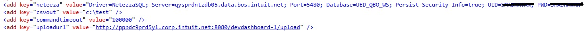
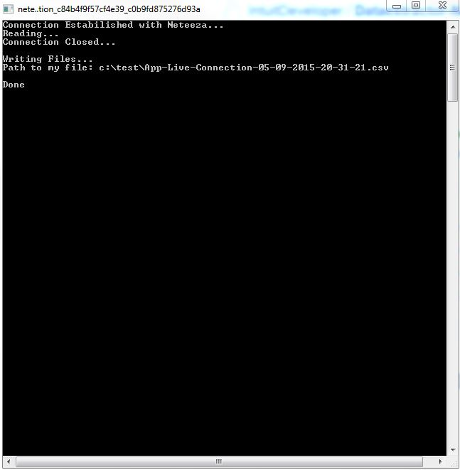
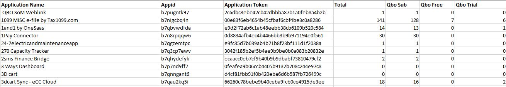

# Dataextractor from Neteeza

* The objective of the program is to cover the dataextraction layer of the design.
* The program expect to be deployed in a environment where access to QDC/LVDC is available.
* Prepare the configuration file as next step.

## Configuration

* neteeza : Datasource
* csvout  : path of csv file
* commandtimeout : time out for odbc connection

## Run

* Clone the git repository
* Open the visual studio project
* Run the project

Note : Target platform of the program == Installed target version of ODBC driver.

## Screen Shots

