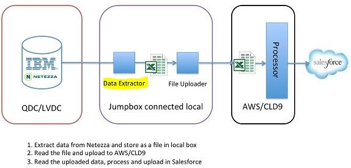
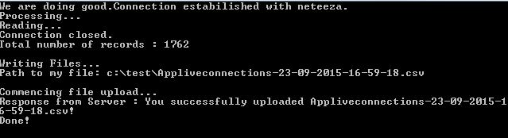

# Dataextractor from Neteeza

* The objective of the program is to cover the dataextraction layer of the design.
* The program expect to be deployed in a environment where access to QDC/LVDC is available.
* Prepare the configuration file as next step.

## Configuration

* neteeza : Datasource
* csvout  : path of csv file
* commandtimeout : time out for odbc connection

## Run

* Clone the git repository
* Open the visual studio project
* Run the project

Note : Target platform of the program == Installed target version of ODBC driver.

## Neteeza Query

		select a.applicationname, a.masterappidshort, b.apptoken,
                            sum(current_flag) Total,
                            sum(case when sub_type = 'QBO Sub' then current_flag else 0 end) QBOSub,
                            sum(case when sub_type = 'QBO Free' then current_flag else 0 end) QBOFree,
                            sum(case when sub_type = 'QBO Trial' then current_flag else 0 end) QBOTrial
                            from weekly_app_connections_detail a , load_partnerapp_appmaster b
                            where sub_type in ('QBO Sub', 'QBO Free', 'QBO Trial') and weekenddate = (select max(weekenddate) from weekly_app_connections_detail) and 
                            a.MASTERAPPID = b.MASTERAPPID 
                            group by a.applicationname,a.masterappidshort,b.apptoken 
                            order by a.applicationname

## Screen Shots

